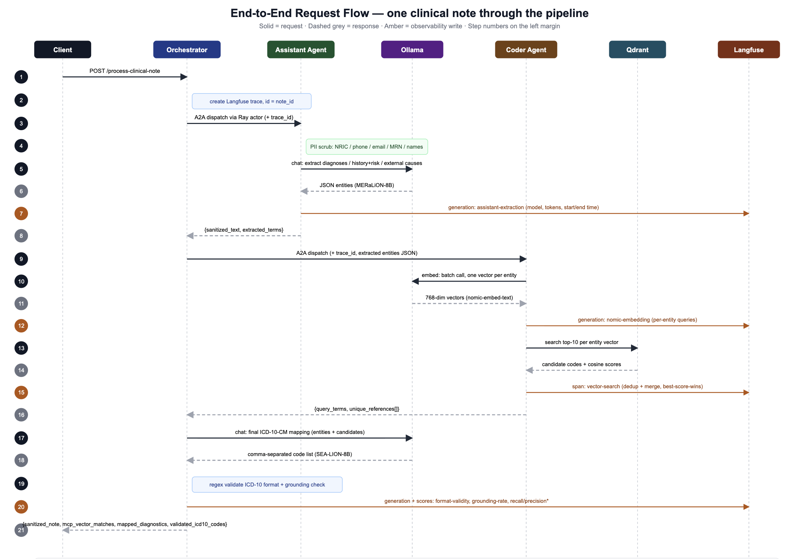

# Sovereign Multi-Agent Clinical Coding Platform

An enterprise-grade, privacy-preserving, local-first architecture designed for secure clinical entity extraction and automated multi-axial ICD-10-CM diagnostic code mapping. The platform leverages a distributed mesh of specialized agent nodes, out-of-process compute workers, a high-speed vector search space, and an end-to-end self-hosted telemetry stack to ensure full data sovereignty and operational auditability.


## 🏗️ Technical Architecture


## 🏗️ Request Flow





## Tech Stack

- Python 3.12+
- FastAPI
- Langfuse
- Ray
- Ollama
- Qdrant
- Clickhouse
- Redis
- A2A
- MCP 
- Render Cloud
- nginx

## 📂 Detailed File Catalog

| File / Module Path | Architecture Role | Technical Responsibility & Behavior |
| :--- | :--- | :--- |
| **`main.py`** | Application Gateway & Routing Bus | Instantiates the core FastAPI portal engine alongside the internal sub-networks (`assistant_app`, `coder_app`). Handles application startup event lifecycle tracking, boots the local Ray cluster environment, and processes incoming clinical data. |
| **`docker-compose.yml`** | Container Orchestration Manifest | Establishes the sandboxed infrastructure workspace. Configures strict service dependencies, network isolation boundaries, persistent data storage volumes, and deep service health checks. |
| **`nginx.conf`** | Network Traffic Proxy Router | Acts as the single point of entry for the application stack. Implements path rewrites, applies internal API authorization header validations, and prevents database containers from being exposed to the public network. |
| **`index.html`** | Single-Page Portal UI | Renders a clean browser dashboard for entering clinical notes, running asynchronous requests, and displaying vector database matches. |
| **`clickhouse-keeper.xml`** | Analytics Clustering Engine | Manages internal synchronization, replication limits, server IDs, and data coordination paths for the analytical ClickHouse storage layer. |
| **`requirements.txt`** | Dependency Lock Manifest | Defines target runtime dependencies including FastAPI, distributed Ray actor tools, local telemetry clients, and vector database utilities. |
| **`agent_cards.py`** | Declarative Agent Specifications | Defines system prompts, operational scopes, metadata tiers, and destination addresses for individual agent microservices. |
| **`src/agent.py`** | Distributed Compute Core | Implements the isolated Ray remote processing engine (`RayA2AAgentActor`)[cite: 21]. Handles asynchronous HTTP requests across workers while maintaining low CPU overhead. |
| **`src/config.py`** | Application Property Registry | Stores central system variables, operational port paths, default dimension profiles (768-d), and model name references. |

---

## 📦 Docker-Compose Service Matrix

The deployment stack coordinates a collection of discrete microservices configured to share an internal software bridge network named `clinical-net`:

1. **`local-ollama-engine`**: Houses your local AI model instances. Runs an automated setup script on first boot to download specific weights, using a strict health check to block downstream workers until the downloads complete.
2. **`clinical-data-ingest`**: An ephemeral worker task that remains dormant until the inference models are fully active. Vectorizes reference data using text embeddings and seeds the local database before exiting.
3. **`clinical-coder-api` / Agents**: Hosts the main FastAPI application gateways and distributed background nodes.
4. **`local-qdrant-db`**: The vector engine that stores and retrieves embeddings using high-speed similarity scoring.
5. **Telemetry Architecture (`langfuse-web`, `langfuse-worker`, `postgres`, `redis`, `clickhouse`, `minio`)**: A multi-tiered analytics system that tracks latency, records token use, and logs processing steps without sending data to external networks.

## 📦 Clone Repo 

git clone https://github.com/sivaramgs/clinical_coder

## Pre-requisite 

Install Docker desktop and set minimum 14 GB RAM in Docker Desktop to avoid Memory errors in self hosted environment.


##  🚀 Step-by-Step Execution Lifecycle

### Step 1: Deploy the Architecture Mesh

Build and spin up the multi-container environment in detached background mode

```terminal

uv init
uv add -r requirements.txt 
source .venv/bin/activate   # On Windows: .venv\Scripts\activate
docker compose up -d
```

## Environment Variables

Create a `.env` file in the project root with the following variables:

You have to setup your langfuse account and create the API keys and update public and secret keys in .env file.

```env
LANGFUSE_SECRET_KEY="sk-lf-c102e865-6b64-491a-a746-0195a5afcee4"   #changeMe
LANGFUSE_PUBLIC_KEY="pk-lf-4019117c-4a4e-4c0e-aada-a405b42c4e0d"   #changeMe
LANGFUSE_BASE_URL="http://langfuse-web:3000"
```

```terminal
docker compose up -d # This will restart only the required containers.
```

## End to End Demo

